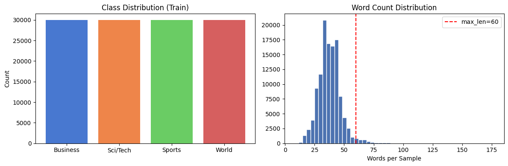
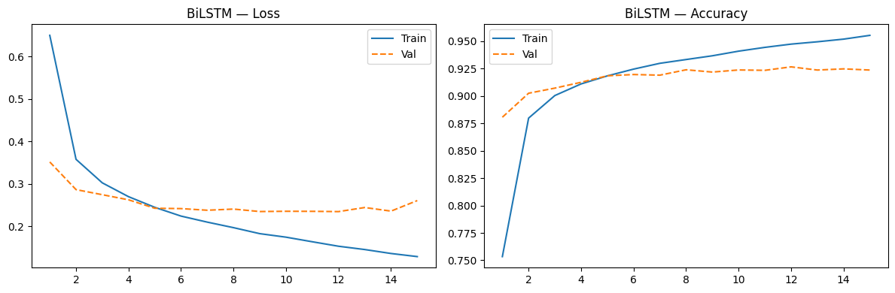
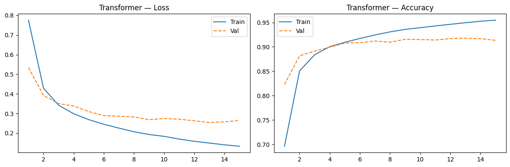
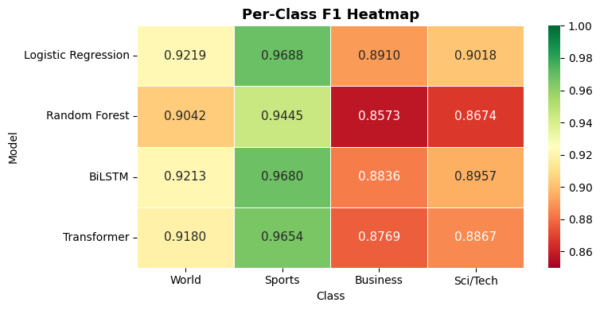
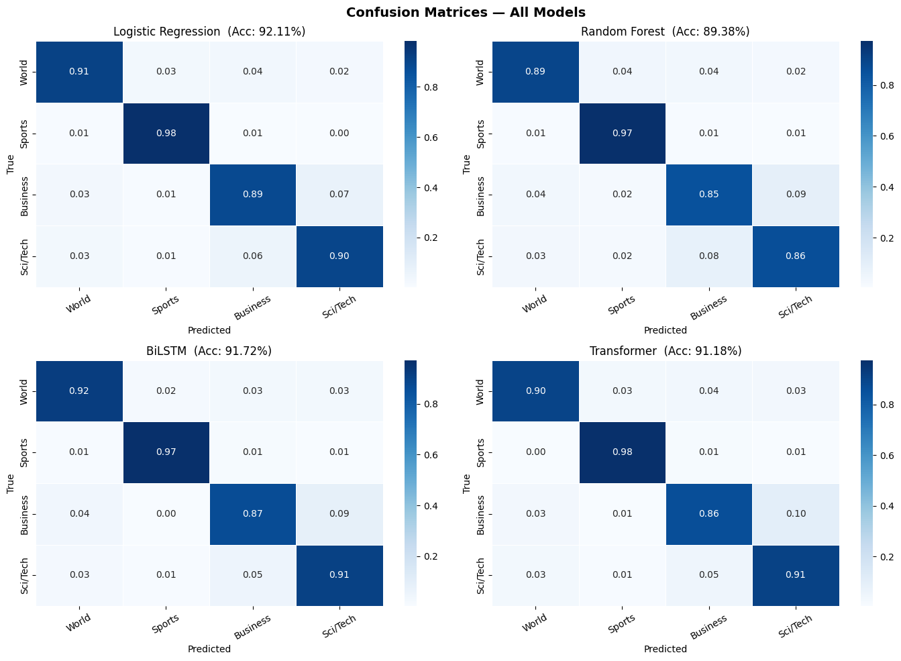
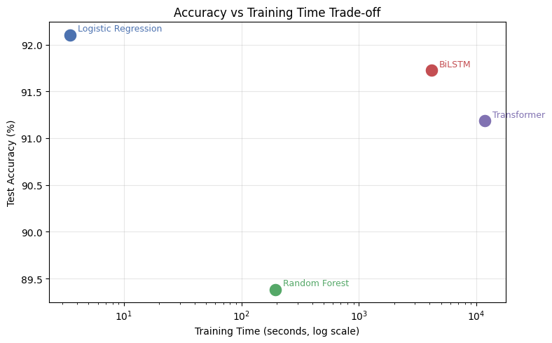
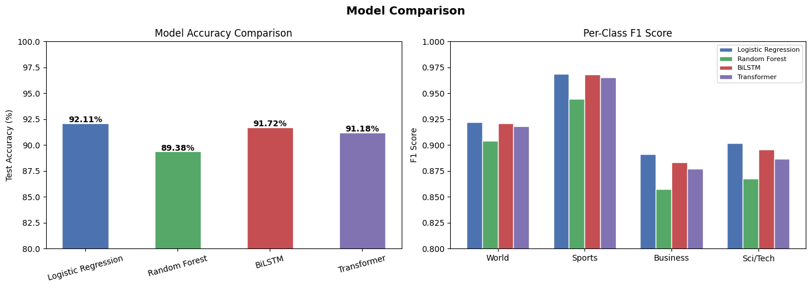

## Abstract

This project evaluates four machine learning approaches for four-class news topic classification on the AG News dataset: Logistic Regression, Random Forest, a Bidirectional LSTM (BiLSTM), and a Transformer with sinusoidal positional encoding. All models are trained on the same data and evaluated under identical conditions. Results show that TF-IDF-based Logistic Regression (92.11%) achieves the highest accuracy overall, closely matching the n-gram TF-IDF baseline reported by Zhang et al. (2015) [1]. The BiLSTM (91.72%) outperforms the scratch Transformer (91.18%), likely because the short 60-token sequences limit the benefit of global self-attention. Business and Science/Technology remain the hardest category pair across all models — a confusion pattern rooted in genuine lexical overlap between the two categories rather than model limitations. The findings confirm that strong feature engineering is competitive with sequence modeling for short, topically structured text.

## Background and Related Work

Automated news categorization is a core NLP task with applications in search, content recommendation, and media monitoring. The AG News corpus, introduced by Zhang, Zhao, and LeCun (2015) as a benchmark in their character-level convolutional network study, has since become one of the most widely used text classification benchmarks [1]. Each sample consists of a headline and short description, labeled into one of four categories: World, Sports, Business, and Science/Technology.

The original paper reported a bag-of-words TF-IDF baseline of 92.36% and a large character-level CNN of 91.45% on the same four-class task, establishing that simple linear models are surprisingly difficult to surpass on this dataset [1]. Joulin et al. (2016) later showed that FastText — a bag-of-ngrams model with subword embeddings — achieves approximately 92.5% in under ten seconds of training [2], further reinforcing that representation quality matters more than architectural complexity when inputs are short and topically structured. Fine-tuned pretrained models such as BERT and RoBERTa push accuracy to the 94–95% range [3], representing the current practical ceiling for models without large-scale pretraining. The gap between scratch models and pretrained models on this dataset is well-documented and attributable to the scale of pretraining rather than task-specific architecture.

The Business vs. Science/Technology confusion is a known dataset-level issue. The NoisyAG-News study (2024) found that instance-dependent label noise is concentrated in ambiguous samples straddling category boundaries — a pattern consistent with the observed Business/SciTech overlap in this work [4].

## Dataset Overview

The AG News dataset contains 120,000 training samples and 7,600 test samples distributed evenly across four classes (30,000 train / 1,900 test per class): **World**, **Sports**, **Business**, and **Science/Technology**. Each sample is a concatenation of a headline and short description, averaging 37.8 words per sample.

{width=90%}

Preprocessing differed by model type:

- **Classical models (LR, RF):** Text was lowercased, stripped of punctuation and URLs, and converted to TF-IDF feature vectors using unigrams and bigrams (30,000 features, sublinear TF scaling, English stop-word removal).
- **Deep learning models (BiLSTM, Transformer):** Text was tokenized with a 10,000-word vocabulary built from training data word frequencies, encoded as integer sequences, and padded to a maximum length of 60 tokens. Embeddings were learned from scratch during training.

A 90/10 stratified split of the training set produced 108,000 training and 12,000 validation samples for neural model training and early stopping.

## Methodology

### Logistic Regression

A TF-IDF vectorizer (unigrams + bigrams, max 30,000 features, sublinear TF) was fitted on the training corpus. The resulting sparse feature matrix was passed to a multinomial Logistic Regression classifier (solver: SAGA, C=1.0, max\_iter=1000). This serves as the primary classical baseline and completes training in under 5 seconds.

### Random Forest

Random Forest was applied using a reduced TF-IDF representation (10,000 features) for tractable training time. An ensemble of 200 decision trees votes on the final label. While effective in low-dimensional tabular settings, Random Forest is known to struggle with the sparse, high-dimensional feature spaces typical of text data.

### Bidirectional LSTM (BiLSTM)

The BiLSTM uses a learned embedding layer (vocab size 10,000, embedding dim 128), two stacked bidirectional LSTM layers (128 hidden units per direction, 256 concatenated), dropout (p=0.3), and a linear classifier head. Training used Adam (lr=1e-3), gradient clipping (norm 1.0), and ReduceLROnPlateau scheduling (patience=2, factor=0.5). Early stopping (patience=3 on validation loss) triggered at epoch 15.

Total trainable parameters: 1,940,484.

{width=90%}

### Transformer

The Transformer adds sinusoidal positional encodings to the same embedding layer, followed by multi-head self-attention encoder blocks and a feedforward classifier. Unlike the BiLSTM, which encodes sequence order through a hidden state, the Transformer attends directly between all token pairs in parallel. The same training utilities were reused (Adam, lr=5e-4, ReduceLROnPlateau, early stopping).

{width=90%}

## Results

All models were evaluated on the 7,600-sample held-out test set. Weighted F1 is reported alongside accuracy.

| Model | Accuracy | F1 (weighted) | Train Time |
|---|---|---|---|
| **Logistic Regression** | **92.11%** | **0.9209** | 3.5 s |
| Random Forest | 89.38% | 0.8933 | 193.4 s |
| BiLSTM | 91.72% | 0.9171 | 4,129.4 s |
| Transformer | 91.18% | 0.9117 | 11,827.9 s |

: Model performance on the AG News test set (7,600 samples). {#tbl-results}

For context, Zhang et al. (2015) reported 92.36% with an n-gram TF-IDF baseline and 91.45% with a large character-level CNN on the same test set [1]. FastText achieves approximately 92.5% in under ten seconds [2]. Fine-tuned BERT and RoBERTa reach 94–95%, representing the current practical ceiling for models without pretraining [3].

### Per-Class F1

| Class | LR | RF | BiLSTM | Transformer |
|---|---|---|---|---|
| World | 0.922 | 0.904 | 0.921 | 0.918 |
| Sports | 0.969 | 0.944 | 0.968 | 0.965 |
| Business | 0.891 | 0.857 | 0.884 | 0.877 |
| SciTech | 0.902 | 0.867 | 0.896 | 0.887 |

: Per-class F1 scores for all models on the AG News test set. {#tbl-f1}

Sports is the easiest class across all models (~94–97% F1), while Business and SciTech are consistently the hardest pair.

{width=85%}

{width=100%}

{width=85%}

{width=95%}

## Analysis

**Logistic Regression is the strongest model overall.** At 92.11%, it nearly matches the n-gram TF-IDF baseline from the original dataset paper (92.36%) and outperforms all sequence models trained from scratch here. This is consistent with a well-established pattern in the literature: for short, topically structured text where word co-occurrence is highly discriminative, a linear classifier over TF-IDF bigrams captures most of the available signal [1][2]. The 60-token input length means there is simply not enough context for sequence models to develop a clear advantage over a well-tuned bag-of-words model.

**Random Forest is the worst performer despite using the same TF-IDF features as Logistic Regression.** This is the expected outcome for sparse, high-dimensional text: decision tree splits evaluate one feature at a time, while logistic regression simultaneously weighs all features globally. Random Forest's strengths lie in low-dimensional, nonlinearly separable settings — not in 10,000-dimensional TF-IDF space.

**BiLSTM outperforms the Transformer on this dataset.** At 91.72% vs. 91.18%, the BiLSTM holds a modest but consistent edge. With sequences padded to only 60 tokens, the Transformer's self-attention mechanism has limited context to exploit, and it requires considerably more training time (11,828 s vs. 4,129 s) to converge without a corresponding accuracy benefit. This mirrors findings in the literature where scratch Transformers underperform recurrent models on short texts when pretrained embeddings are absent.

**The Business/SciTech confusion is a dataset-level constraint, not a modeling failure.** Across all four models, Business and SciTech consistently produce the lowest F1 scores. This is expected: technology companies publish financial results, and science journalism frequently covers industry implications — the vocabularies genuinely overlap. The NoisyAG-News study (2024) found that instance-dependent label noise concentrates in ambiguous samples at category boundaries, establishing a practical ceiling on how much any classifier can improve without richer input context [4].

**Training cost is the key practical differentiator.** Logistic Regression completes in 3.5 seconds. The BiLSTM requires over an hour; the Transformer over three hours. For a task where the accuracy difference between these models is under 1 percentage point, the computational cost of the neural approaches is difficult to justify in a deployment setting.

## Conclusion

Across four models on AG News, the key finding is that feature representation matters more than architectural complexity for short, topically structured news text. TF-IDF Logistic Regression achieved the highest accuracy (92.11%), consistent with both the original dataset paper [1] and subsequent FastText results [2], confirming that bigram features capture most of the discriminative signal available in 60-token inputs. Among deep learning models trained from scratch, the BiLSTM outperformed the Transformer, likely because the short input length limits the benefit of global self-attention. Random Forest was the clear underperformer due to its unsuitability for sparse, high-dimensional text representations.

The remaining gap between scratch models (~92%) and fine-tuned BERT/RoBERTa (~94–95%) [3] is attributable to the scale of pretraining rather than task-specific architecture. Future work should explore initializing embeddings from pretrained GloVe or FastText vectors — a low-cost modification expected to close 1–2% of that gap without changing any model architecture — and fine-tuning a pretrained BERT model as a strong upper bound. Longer input contexts (full article bodies rather than headline-description pairs) could also reduce the Business/SciTech confusion that remains irreducible at current input lengths [4].

## References

[1] Zhang, X., Zhao, J., & LeCun, Y. (2015). Character-level convolutional networks for text classification. *Advances in Neural Information Processing Systems*, 28. <https://arxiv.org/abs/1509.01626>

[2] Joulin, A., Grave, E., Bojanowski, P., & Mikolov, T. (2016). Bag of tricks for efficient text classification. *Proceedings of EACL 2017*. <https://arxiv.org/abs/1607.01759>

[3] Valdes Gonzalez, A. A. (2026). Cost-aware model selection for text classification: Multi-objective trade-offs between fine-tuned encoders and LLM prompting in production. *arXiv preprint*. <https://arxiv.org/abs/2602.06370>

[4] Huang, H., et al. (2024). NoisyAG-News: A benchmark for addressing instance-dependent label noise in text classification. *arXiv preprint*. <https://arxiv.org/abs/2407.06579>

